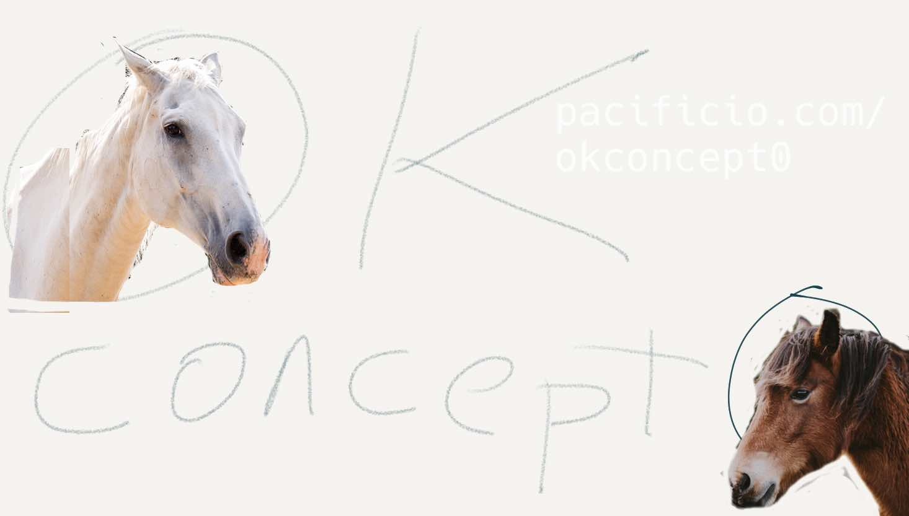

**OkConcept0**

*♘* *🐴*

*OkConcept0:*

⚬ an API server for creating, reading, updating and destroying objects in MongoDB

⚬ a UI for interacting with the API

*a port of [Seis](https://bitbucket.org/pacificpelican/seis/src) for MongoDB*

*by [Dan McKeown](http://danmckeown.info) at [pacificIO](https://pacificio.com) copyright 2019*

---



---

*QuickStart*

___

**installation:**
___

*Download the app with Git:*
```bash
git clone https://github.com/pacificpelican/okconcept0.git
cd okconcept0
```

*Install the app with NPM or Yarn:*

```bash
npm install
# or
yarn
```

*Install MongoDB database*

```bash
brew install mongodb
# or
**install MongoDB directly**
```

___

**running:**
___

*Turn on MongoDB*

```bash
brew services start mongodb
# or
mongod
```

*Run the app on your local system:*

```bash
npm run dev
# or
yarn dev
```

*Open the app default UI in a browser (or make requests via the API):*

`open http://localhost:3011`

`curl http://localhost:3011/api/1/getdbdata/db/seisdb/object/seis`
___

<section id="propsInfo">
  <h3>OkConcept0</h3>
  <h3><a href="http://okconcept0.pacificio.com">🆗</a></h3>
  <h6>
    an object cycle noSQL database manager by 
    <a href="http://danmckeown.info">Dan McKeown</a>
  </h6>
  <br />
  <span id="copright">copyright 2019</span>
  <br />
  <br />
  <li>
    You can view objects by entering them into the input at 
    <a href="/Objectbrowser">Objectbrowser</a>
  </li>
  <li>
    After visualizing the object with the `enter JSON object` button you
    can persist the data to MongoDB by pressing the `save to DB` button
  </li>
  <li>
    Database is saved by default to the Mongo database at the  
    `mongodb://localhost:27017/` address
  </li>
  <li>
    These saved objects can be viewed at <a href="/Desk">Desk</a> 
    (search for seis as the database object name) in chronological
    order
  </li>
  <li>
    Edit, View and Delete are given the URL parameters they require to
    work via clicks on the links in Desk output
  </li>
  <li>
    Clicking on the red X will take you to the Delete page where you
    can confirm deletion (of that entire object)
  </li>
  <li>
    When an object is created, along with the normal metadata, a
    special locator property is added. This is used as a kind of ID
    for editing and deleting
  </li>
</section>

<article id="appTree">
  <h3>App Component Tree</h3>
  <ul>
    <li>
      <a href="./Objectbrowser">Objectbrowser</a> →
      SpreadsheetObjectbrowser → SpreadsheetCoreRecursive
    </li>
    <li>
      <a href="./Desk">Desk</a> → Spreadsheet →
      SpreadsheetCoreRecursiveClick
    </li>
    <li>
      <a href="./View">View</a> → SpreadsheetCoreRecursive
    </li>
  </ul>
  <h3>API</h3>
  <ul id="routes">
    <li>
      GET database object collection: 
      <code>/api/1/getdbdata/db/seisdb/object/seis</code>
      <span className="info">
        <a href="/Desk">Desk</a>, <a href="/Spiral">Spiralviewer</a>
      </span>
    </li>
    <li>
      GET one database object by locator: 
      <code>/api/1/getdbdata/db/seisdb/object/seis/tuple/14206</code>
      <span className="info">
        <a href="/View">View</a>
      </span>
    </li>
    <li>
      POST create new database object: 
      <code>
        /api/1/saveobjectdata/db/seisdb/obj/seis/newdata/%22%20%7B%20%5C%22name%5C%22%3A%20%5C%22Bogey%5C%22%20%7D%22
      </code>
      <span className="info">
        <a href="/Objectbrowser">Objectbrowser</a>
      </span>
    </li>
    <li>
      POST (shallow) create new database object: 
      <code>
        /api/1/saveobjectdatashallow/db/spiraldb/obj/notes/newdata/%7B%22note%22%3A%22I%20love%20the%20cat!%22%2C%22savedAt%22%3A1554680275455%7D
      </code>
      <span className="info">
        <a href="/Spiral">Spiral</a>
      </span>
    </li>
    <li>
      POST update existing database object by locator property: 
      <code>
        /api/1/updatedata/db/seisdb/object/seis/objprop/Bogey/objkey/name/newval/Belle/tuple/99372
      </code>
      <span className="info">
        <a href="/Edit">Edit</a>
      </span>
    </li>
    <li>
      POST delete existing database object by locator property: 
      <code>/api/1/deletedata/db/seisdb/object/seis/tuple/15540</code>
      <span className="info">
        <a href="/Delete">Delete</a>
      </span>
    </li>
  </ul>
</article>

---

### OkConcept0 is built on modern web technologies

okconcept0 is from [Pacific IO](https://pacificio.com) and uses [NextJS](https://nextjs.org/) for front-end with [custom server and routing](https://github.com/zeit/next.js#custom-server-and-routing) and [ExpressJS](https://expressjs.com/) and was scaffolded using [create-next-app](https://open.segment.com/create-next-app/).  The UI is built with [ReactJS](https://reactjs.org/) components.  The app's databases are powered by [MongoDB](https://mongodb.com).

---

### Known Issues

- the Edit functionality will only edit top level object properties
- arrays of JSON passed into Objectbrowser will not save since they are not objects
- dev only: no ENV variables for production at the moment

---

## Connection to SEIS project

- OkConcept0 started as a fork of the [Seis project](https://seis.pacificio.com) with the difference being that OkConcept0 uses MongoDB instead of LokiJS as its database backend (while maintaing v1 data API compatability).
